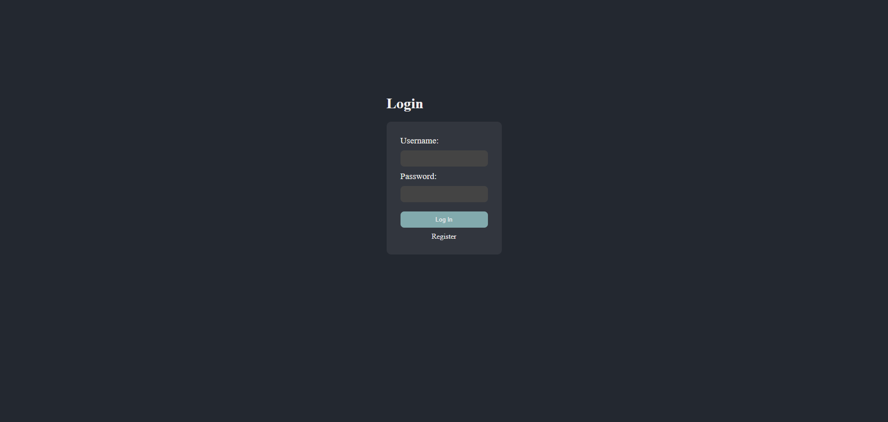

# Todo List Website

Welcome to TodoList Website! This project is a React TypeScript application that helps you organize your tasks effectively.

## Preview

*Login Page*

*Registration Page*

*Adding a Task*

*Task Added*

*Viewing More Tasks*

*Deleting ear Task*

*Completing the Homework Task*

## How It Works
### Description
Todo List Website is a simple task management application built with React and TypeScript. It allows users to create an account, log in, add tasks, mark tasks as complete, and delete tasks.

### Key Features:
#### User Authentication:
Securely create an account or log in to access task management features.

#### Task Management:
Add tasks to your list, mark them as complete, or delete them as needed.

#### Easy-to-Use Interface:
The interface is designed for simplicity, making it easy to navigate and manage tasks.

#### Privacy and Security:
Your data is encrypted and secure, ensuring your privacy is protected.

#### Todo List Website simplifies task management, helping users stay organized and focused on their tasks.
------------------------------------------------------------------------------------------------------------------------------------------------------------------------------------------------------------------------

This project was created by Bocti. Feel free to [reach out](bacter.cris1@gmail.com) with any questions or feedback.
